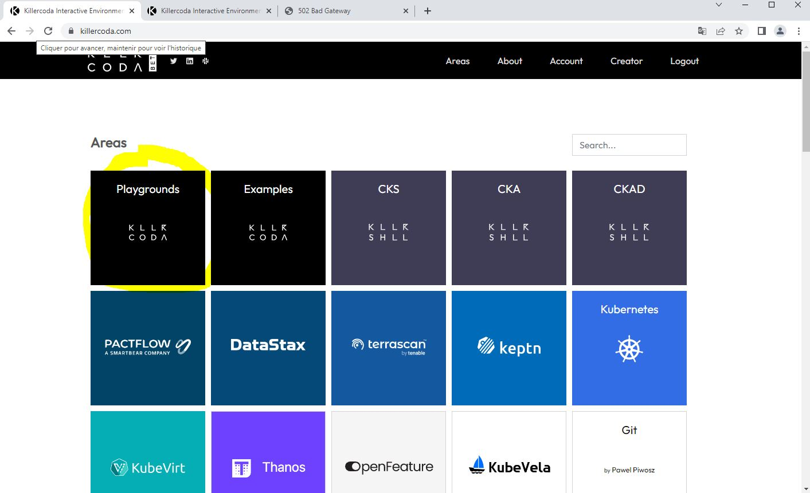

# Demo-DevOps
procédure et fichiers utiles à une démonstration sur les principes DevOps et Kubernetes
s'appuyant sur des playgrounds de KillerCoda

- se connecter sur killercoda.com


- cliquer sur "Playgrounds" puis "Kubernetes 1.xx" afin de lancer un environnement Kubernetes bac-à-sable




- aller dans le menu à trois barres horizontales, tout en haut à droite, et selectionner "Traffic / Ports"


- dans la nouvelle fenêtre, sasir "32111" dans un des champs "Custom Ports" et cliquer sur le "Access" accolé


- faire un "copier" de l'entrée DNS obtenue, sans la partie "https://"


- coller le résultat dans la variable indiquée ci-dessous et appliquer la procédure

```
export URL=7bab38f1-beb3-4972-9f98-393faae4105a-10-244-27-30-32111.spch.r.killercoda.com 
curl https://raw.githubusercontent.com/Alcyor-Lyon/Demo-DevOps/main/01-installationAppliDemo.ksh | bash
```

la fin du shell, l'URL accés à l'applicatif est affichée et clickable
ainsi qu'une commande que vous pouvez copier/coller sur un serveur externe

- depuis une autre fenêtre, retourner sur killercoda.com
- cliquer sur "Playgrounds" puis "Ubuntu" afin de lancer un environnement Linux bac-à-sable

```
export URL=7bab38f1-beb3-4972-9f98-393faae4105a-10-244-27-30-32111.spch.r.killercoda.com 
while : ; do    curl --max-time 2 https://$URL 2>/dev/null | egrep -v "title|height" | sed s/\\\&eacute\\\;/e/ | egrep -i "alcyor" || echo "incident, appli inaccessible ou très lente" ;   sleep 1; done
```

quand les constats de bon fonctionnement et de disponibilité sont faits, 
nous pouvons mettre à jour le site pour corriger les accents, de mettre à jour le logo et de changer l'image souche

```
Demo-DevOps/03-updateAppli.ksh
```

l'idée étant de valider que la mise à jour je passe sans coupure de service alors qu'il n'y a qu'un seul conteneur 
(mise à jour en rolling upgrade)

nous pouvons alors aller sur l'URL kubeinvaders qui est
``` 
echo "https://$URL" | sed s/32111/32100/
``` 

et quand le jeu et les impacts sur l'applicatifs ont été expliqués

```
kubectl scale deployment -n namespace1 nginx-deployment --replicas=25
```
et trouver un volontaire pour tenter sa chance

